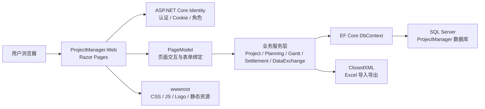

# 项目管理系统架构说明书

版本：2026-07-03  
项目：ProjectManager  
类型：ASP.NET Core Razor Pages 内网项目管理系统

## 1. 文档目的

本文档说明本项目的整体架构、运行组件、代码分层、数据边界、权限模型和关键技术实现，供开发、交接、部署和后续维护使用。

数据库字段级说明请参考：

- `docs/sql-data-dictionary.md`
- `db/sql-data-dictionary.md`

## 2. 系统概览

本系统用于管理企业内部项目、专案进度、请购记录、月结、规划中专案、保养订单、用户权限、操作留痕、Excel 导入导出和甘特图报表。

系统采用单体 Web 架构：

- 前端：Razor Pages + Bootstrap + 自定义 CSS/JavaScript
- 后端：ASP.NET Core 9 Razor Pages
- 数据访问：Entity Framework Core 9
- 数据库：SQL Server / SQL Server Express
- 身份认证：ASP.NET Core Identity
- Excel 处理：ClosedXML
- 测试：xUnit + FluentAssertions + ASP.NET Core WebApplicationFactory

## 3. 架构图



## 4. 代码目录结构

```text
ProjectManager.sln
src/
  ProjectManager.Web/
    Program.cs                    程序入口、DI、认证、路由、自动迁移/种子数据
    appsettings.json              默认数据库连接和管理员种子账号
    Data/
      ApplicationDbContext.cs     EF Core 上下文与模型配置
      SeedData.cs                 初始化角色、状态、管理员账号
    Models/                       数据实体
    Services/                     业务服务、报表、导入导出、分页、审计、甘特图
    Security/
      RoleNames.cs                角色常量和显示名
    Pages/                        Razor Pages 业务页面
    Areas/Identity/               登录、退出、账号管理页面
    wwwroot/                      前端资源
    Migrations/                   EF Core 数据库迁移
tests/
  ProjectManager.Tests/           单元测试、服务测试、Web 冒烟测试
docs/                             设计、架构、部署、维护和数据字典文档
scripts/
  dotnet.ps1                      统一调用 dotnet 的包装脚本
  sql-data-dictionary.sql         SQL 数据字典生成脚本
  visual-regression.ps1           视觉回归检查脚本
```

## 5. 运行时启动流程

启动入口为 `src/ProjectManager.Web/Program.cs`。

1. 读取 `ConnectionStrings:DefaultConnection`。
2. 注册 `ApplicationDbContext`，数据库提供程序为 SQL Server。
3. 注册 Identity，使用 `ApplicationUser` 和角色表。
4. 配置 Cookie：
   - 默认登录保持 14 天。
   - 开启滑动过期。
5. 注册 Razor Pages 和业务服务。
6. 根据环境启用开发异常页或生产异常页。
7. 启用静态资源、认证、授权、Razor Pages 路由。
8. 调用 `SeedData.EnsureSeededAsync`：
   - 应用数据库迁移。
   - 初始化角色。
   - 初始化项目状态。
   - 初始化管理员账号。

## 6. 主要业务模块

| 模块 | 页面目录 | 主要服务 | 说明 |
| --- | --- | --- | --- |
| 首页仪表盘 | `Pages/Index.*` | `ApplicationDbContext` / 图表模型 | 展示关键指标、图形化概览 |
| 后台项目管理 | `Pages/Admin/Projects` | `ProjectMaintenanceService` / `ProjectQueryService` | 项目新增、编辑、详情、导入、删除、分页筛选 |
| 工作台专案 | `Pages/Workbench/Projects` | `WorkbenchProjectService` / `ProjectGanttService` | 项目人员使用的项目列表、详情、进度、甘特图 |
| 规划中专案 | `Pages/Workbench/PlanningProjects` | `PlanningProjectService` / `UserLookupService` | 规划阶段专案、负责人、说明、导入、打印 |
| 保养订单 | `Pages/Admin/MaintenanceOrders` | `MaintenanceOrderService` | 保养订单维护、移交百分比和列表统计 |
| 月结 | `Pages/Settlements` | `SettlementService` | 月结批次、明细、打印 |
| 未结案报表 | `Pages/Reports/OpenProjects` | `ProjectQueryService` / `ExcelReportService` | 未结案查询、统计、打印、导出 |
| 用户管理 | `Pages/Admin/Users` | `UserManager<ApplicationUser>` | 用户、角色、重置密码 |
| 状态设置 | `Pages/Admin/Statuses` | `StatusMaintenanceService` | 项目状态与流程节点管理 |
| 数据导入导出 | `Pages/Admin/DataExchange` | `DataExchangeService` | 管理员全量 Excel 导入导出 |
| 审计留痕 | Shared + Service | `AuditLogService` / `ProjectAuditChangeBuilder` | 保存项目新增、修改、状态变更等操作记录 |

## 7. 服务层职责

| 服务 | 职责 |
| --- | --- |
| `ProjectQueryService` | 项目查询、筛选、分页、报表数据源 |
| `ProjectMaintenanceService` | 后台项目维护、软删除、批量删除 |
| `WorkbenchProjectService` | 工作台项目读取与进度更新 |
| `PlanningProjectService` | 规划中专案 CRUD、分页、批量删除、导入 |
| `MaintenanceOrderService` | 保养订单 CRUD、分页、批量删除 |
| `SettlementService` | 月结批次生成、明细计算、查询 |
| `ExcelReportService` | 项目报表 Excel 导出 |
| `DataExchangeService` | 管理员全量数据 Excel 导入导出 |
| `ProjectGanttService` | 甘特图保存、展示月份计算、Excel 导出 |
| `AuditLogService` | 操作记录写入 |
| `ProjectAuditChangeBuilder` | 生成项目变更前后差异 |
| `UserLookupService` | 导入时按账号、姓名、邮箱、ID、简繁转换匹配用户 |
| `RichTextSanitizer` | 前台富文本说明内容清洗 |
| `Pagination` | 统一分页参数与数据库分页 |

## 8. 数据架构

核心数据实体：

- `ApplicationUser`：系统用户，扩展显示名、启用状态、弱管理账号标识。
- `Project`：项目主数据。
- `ProjectAssignment`：项目人员分配。
- `ProjectStatus` / `ProjectStatusStyle`：项目状态和状态样式。
- `ProjectSkippedStatus`：项目详情流程节点中允许跳过的状态。
- `PurchaseRequest`：请购记录。
- `MonthlySettlementBatch` / `MonthlySettlementItem`：月结批次和明细。
- `PlanningProject` / `PlanningProjectHistoryRecord`：规划中专案和历史记录。
- `MaintenanceOrder`：保养订单。
- `AuditLog`：审计日志。
- `ProjectGanttPlan` / `ProjectGanttTask`：项目甘特图计划和细分任务。

主要设计约束：

- 项目采用软删除，`IsDeleted = true` 后默认列表不显示。
- 项目唯一业务键为 `Year + ProjectNumber + 未删除`。
- 金额字段使用 decimal 精度。
- 百分比字段统一限制在 0 到 100。
- 人员外键多使用 Restrict，避免删除账号时破坏历史数据。
- 项目详情和审计日志通过 `ProjectId` 建索引提升查询速度。

## 9. 权限架构

角色定义位于 `src/ProjectManager.Web/Security/RoleNames.cs`。

| 角色 | 用途 |
| --- | --- |
| `Administrator` | 系统管理员，拥有后台维护、用户、状态、导入导出等能力 |
| `ProjectStaff` | 项目人员，使用工作台维护自己参与项目 |
| `Leader` | 领导角色，查看项目和专案信息 |
| `Viewer` | 查询人员，只读查看 |
| `SubCaseContact` | 子案对接人员 |

权限实现方式：

- Razor Page 使用 `[Authorize(Roles = "...")]` 控制页面访问。
- 列表批量删除只在有对应删除业务和权限的页面展示。
- 用户管理、数据导入导出、状态设置属于管理员能力。
- 工作台专案列表不强行增加删除业务。

## 10. 前端架构

前端主要资源：

- `Pages/Shared/_Layout.cshtml`：整体布局、菜单、Logo。
- `wwwroot/css/site.css`：现代商务风视觉系统、表格、卡片、动效、进度条、响应式样式。
- `wwwroot/js/site.js`：密码显示/隐藏、批量选择、批量删除确认、图表动画、甘特图交互等。
- Shared 局部视图：
  - `_Pagination.cshtml`
  - `_PercentBar.cshtml`
  - `_StatusTimeline.cshtml`
  - `_AuditTrail.cshtml`
  - `_ProjectGanttPanel.cshtml`
  - `_ProjectDetailVisual.cshtml`

前端动效原则：

- 使用轻微悬浮和淡入动画。
- 避免夸张晃动。
- 遵守 `prefers-reduced-motion`，减少动效时不强制动画。

## 11. 分页和列表架构

统一分页逻辑位于 `src/ProjectManager.Web/Services/Pagination.cs`。

允许条数：

- 10
- 20
- 50
- 100

默认值：

- `20`

非法值处理：

- `PageSize` 非法时回退 20。
- `PageNumber < 1` 时回退 1。
- 查询使用数据库分页：`CountAsync` + `Skip` + `Take`，避免先加载全量数据再内存分页。

## 12. Excel 导入导出架构

Excel 使用 ClosedXML 实现，不依赖外部 Office 或第三方服务。

主要入口：

- 管理员全量导入导出：`Admin/DataExchange`
- 项目批量导入：`Admin/Projects/Import`
- 规划中专案批量导入：`Workbench/PlanningProjects/Import`
- 报表导出：`ExcelReportService`
- 甘特图导出：`ProjectGanttService`

格式约束：

- 当前导入统一建议使用 `.xlsx`。
- `.xls` 不作为正式支持格式。
- 用户识别通过 `UserLookupService` 支持账号、ID、邮箱、显示名和部分简繁体人名匹配。

## 13. 甘特图架构

甘特图数据由以下实体保存：

- `ProjectGanttPlan`：项目整体开始日、完成日、进度说明。
- `ProjectGanttTask`：细分工作、预计开始日、预计完成日、当前进度、进度说明。

展示和导出由 `ProjectGanttService` 负责：

- 自动根据整体日期和细分工作日期计算时间轴。
- 总跨度较小时按月显示。
- 总跨度较大时自动改为 2、3、6、12 个月一个刻度，减少横向挤压。
- Excel 导出按参考图格式生成带颜色条形的甘特图。

## 14. 审计架构

审计目标：

- 保存每个项目新增、修改、状态变化等关键操作。
- 记录修改人、修改时间、修改内容。
- 项目详情页可回溯查看。

关键类：

- `AuditLogService`
- `ProjectAuditChangeBuilder`
- `AuditLog`
- `Pages/Shared/_AuditTrail.cshtml`

审计记录内容：

- 操作用户 ID
- 操作类型
- 实体名称和实体 ID
- 项目 ID / 工号
- 变更摘要
- 结构化变更详情 JSON
- 创建时间

## 15. 测试架构

测试项目：

- `tests/ProjectManager.Tests`

测试覆盖：

- 服务层分页、删除、查询、报表、月结、甘特图、审计。
- 数据上下文持久化。
- 登录、权限、中文界面、核心页面访问。
- Excel 导入导出关键行为。

常用命令：

```powershell
.\scripts\dotnet.ps1 test ProjectManager.sln
.\scripts\dotnet.ps1 build ProjectManager.sln
node --check src\ProjectManager.Web\wwwroot\js\site.js
```

## 16. 外部依赖

| 依赖 | 版本/说明 |
| --- | --- |
| .NET | net9.0 |
| SQL Server | SQL Server / SQL Server Express |
| Entity Framework Core | 9.0.4 |
| ASP.NET Core Identity | 9.0.4 |
| ClosedXML | 0.105.0 |
| xUnit | 测试框架 |
| FluentAssertions | 测试断言 |

## 17. 架构约束和注意事项

1. 不建议绕过服务层直接在页面里写复杂业务。
2. 数据修改要尽量记录审计，尤其是项目主数据和进度。
3. 新列表页应复用 `PagedResult<T>` 和 `PageSizeOptions`。
4. 新 Excel 导入功能应限制 `.xlsx`，并提供模板。
5. 新页面的权限应使用现有 `RoleNames`，不要随意新建字符串角色。
6. 富文本说明必须通过 `RichTextSanitizer` 清洗后保存。
7. 删除优先使用软删除，避免破坏历史月结、审计和报表。

## 18. 前端资源分层（2026-07-14）

前端资源已从单一 `site.css`、`site.js` 拆分：

- `wwwroot/css/base.css`：设计变量、应用外壳、全局控件和可访问性基础。
- `wwwroot/css/components.css`：表格、卡片、筛选器、Tooltip、空状态等共享组件。
- `wwwroot/css/pages.css`：页面布局、甘特图和列印规则。
- `wwwroot/css/themes.css`：主题、动效等级和装饰效果。
- `wwwroot/js/site.js`：ES Module 入口，根据页面 `data-*` 标记按需载入组件。
- `wwwroot/js/core`、`components`、`pages`、`effects`：按职责存放模块。

`site.css` 保留为兼容标记，不再由布局载入。界面源码以繁体中文为规范来源，简体中文继续由显示语言中间件转换；动态业务名称需使用 `data-language-preserve` 保持原值。

## 19. 資料工作台與個人檢視（2026-07-14）

- `SavedDataViews` 以使用者與頁面鍵隔離個人檢視，保存篩選、可見欄位、欄位順序、行距與預設狀態。
- `DataViewRegistry` 定義四個支援頁面的篩選／欄位白名單與不可變系統預設；瀏覽器不提交使用者 ID。
- `SavedDataViewService` 正規化 JSON、忽略過期欄位，並以交易保證同一使用者、同一頁面最多一個預設檢視。
- 專案總覽、未結案報表、我的專案與保養訂單共用 `_SavedDataViewBar`，由伺服器輸出初始欄位與行距，避免載入閃動。
- 未結案報表保留 17 個穩定欄位鍵，預設只顯示九個高優先欄位，專案工號與名稱在桌面端凍結。
