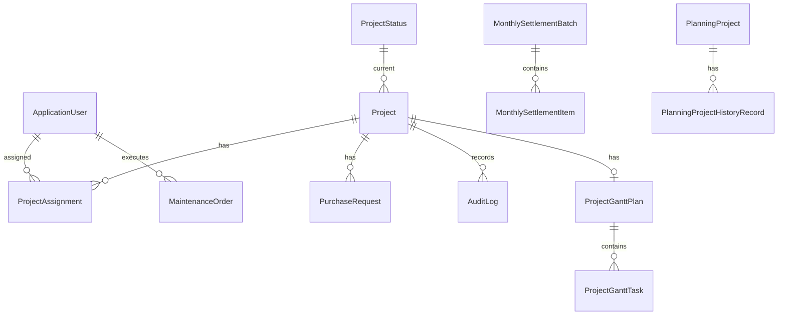

# 项目管理系统设计文档

版本：2026-07-03  
项目：ProjectManager

## 1. 产品定位

本系统定位为企业内网使用的现代商务风项目管理平台，用于统一管理项目立项、进度、请购、月结、规划中专案、保养订单、甘特图、报表和操作留痕。

设计目标：

- 让项目资料集中维护，减少 Excel 分散管理。
- 让项目进度、请购和收款状态可视化。
- 支持管理员批量导入导出，方便迁移和备份。
- 支持项目详情留痕，便于工作追踪和责任回溯。
- 页面风格统一、清爽、适合长期办公使用。

## 2. 用户角色设计

| 角色 | 主要使用场景 |
| --- | --- |
| 系统管理员 | 用户维护、项目维护、状态设置、数据导入导出、删除和批量操作 |
| 项目人员 | 查看和维护自己参与的项目，更新项目说明、甘特图、进度 |
| 领导 | 查看项目进度、报表、专案状态 |
| 查询人员 | 只读查看项目和报表 |
| 子案对接人员 | 作为请购或子案联系人参与业务流程 |

## 3. 信息架构

主导航建议理解为四类：

1. 工作台
   - 项目工作台
   - 规划中专案
2. 管理后台
   - 项目管理
   - 用户管理
   - 状态设置
   - 保养订单
   - 数据导入导出
3. 月结和报表
   - 月结批次
   - 未结案报表
4. 账号
   - 登录
   - 退出
   - 密码管理

## 4. 核心业务流程

### 4.1 项目主流程

说明：

- 状态来自 `ProjectStatus`，管理员可维护。
- 部分项目可禁用不需要的流程节点，通过 `ProjectSkippedStatus` 保存跳过状态。
- 达到结案状态时应填写结案年月。
- 项目详情页以时间线和图形化方式展示当前阶段。

### 4.2 项目维护流程

1. 管理员新增项目或批量导入项目。
2. 维护项目人员、金额、进度、请购记录。
3. 项目人员在工作台查看被分配项目。
4. 项目人员更新进度说明、甘特图和细分任务。
5. 系统记录操作日志。
6. 项目进入月结或结案报表。

### 4.3 规划中专案流程

1. 新增规划中专案。
2. 指定负责人、厂商和最新说明。
3. 支持批量导入。
4. 支持列表筛选、打印、批量删除。
5. 正式立项后可在项目管理中新增正式项目。

### 4.4 月结流程

1. 选择年份和月份。
2. 生成月结批次。
3. 系统保存当时的项目快照到月结明细。
4. 后续项目变化不影响已生成月结历史。
5. 可查看、打印月结明细。

### 4.5 甘特图流程

1. 在项目详情页点击甘特图。
2. 蓝色区域项目基础信息由系统自动带入。
3. 用户维护整体开始日、完成日、细分工作、预计日期、当前进度、进度说明。
4. 保存后可在详情页查看。
5. 支持报表列印。
6. 支持导出带图形条的 Excel 甘特图。

## 5. 页面设计原则

整体视觉方向：

- 现代 SaaS 产品风格。
- 浅色工作台。
- 菜单栏与内容区风格统一。
- 蓝绿强调色，用于主操作、进度、图表和状态。
- 紧凑表格，适合业务人员高频查看。
- 卡片使用轻微悬浮效果，避免明显晃动。
- 圆角控制在 8px 左右。

交互原则：

- 列表页优先展示筛选、统计和关键操作。
- 批量删除必须有复选框和二次确认。
- 分页条数统一为 10 / 20 / 50 / 100。
- 页面按钮尽量使用明确文案和一致样式。
- 重要导出、导入操作提供模板或格式提示。
- 密码输入框提供显示/隐藏功能。

## 6. 列表页设计

所有主要列表页应包含：

- 高级筛选区。
- 关键指标或小型图表。
- 数据表格。
- 分页条数选择。
- 当前页和总数提示。
- 有权限时显示批量选择和批量删除。
- 空数据状态。

分页规则：

- 默认每页 20 条。
- 用户可选择 10、20、50、100。
- 切换条数时保留筛选条件，并回到第 1 页。
- 非法分页参数自动回退。

## 7. 图形化设计

图形化展示采用原生 SVG、HTML、CSS 和少量 JavaScript，不依赖外部 CDN。

主要图形：

- 首页总览指标卡。
- 状态分布图。
- 未结案占比。
- 月结趋势。
- 负责人/厂商分布。
- 保养方式分布。
- 百分比进度条。
- 甘特图时间轴。

百分比展示规则：

- 0 到 30：偏低进度颜色。
- 30 到 70：中间进度颜色。
- 70 到 99：接近完成颜色。
- 100：使用完成专属颜色。
- 详情页和列表页涉及百分比时尽量配套小进度条。

## 8. 数据设计摘要

完整字段请参考 `docs/sql-data-dictionary.md`。

关键实体关系：

## 9. 表单和校验设计

通用校验：

- 年度范围：2000 到 2100。
- 金额不能为负数。
- 百分比必须在 0 到 100。
- 项目工号不能为空。
- 工程名称不能为空。
- 结案状态需要结案年月。
- 甘特图完成日不能早于开始日。
- Excel 导入仅支持 `.xlsx`。

富文本说明：

- 进度说明允许颜色标记。
- 保存前通过 `RichTextSanitizer` 清洗。
- 展示时保留安全范围内的样式。

## 10. Excel 设计

### 10.1 管理员全量导入导出

入口：后台数据导入导出。

工作表：

- `Users`
- `ProjectStatuses`
- `Projects`
- `PurchaseRequests`
- `PlanningProjects`
- `MaintenanceOrders`

用途：

- 数据备份。
- 批量迁移。
- 管理员批量维护。

### 10.2 项目批量导入

字段：

- 工号
- 工程名称
- 项目人员
- 金额
- 进度说明

规则：

- 年份由导入页面选择。
- 项目人员支持账号、姓名、邮箱、ID。
- 多个人员可用逗号、分号等分隔。
- 已有项目按年度和工号更新。

### 10.3 规划中专案批量导入

字段：

- 项目名
- 项目负责人
- 厂商
- 最新说明

规则：

- 仅支持 `.xlsx`。
- 负责人支持中文名、简繁体名、账号、邮箱或 ID 匹配。

### 10.4 甘特图导出

导出要求：

- 不只是数据表，必须包含类似甘特图的颜色条。
- 时间轴可按 1、2、3、6、12 个月自动调整刻度。
- 文字不能明显挤压。
- 支持横向打印。

## 11. 审计留痕设计

项目新增、编辑和关键进度修改需要写入审计日志。

展示内容：

- 修改人。
- 修改时间。
- 修改类型。
- 修改内容摘要。
- 字段级变更前后值。

设计原则：

- 审计日志不可作为普通列表删除。
- 项目详情页可按项目查看相关记录。
- 管理员用于问题追溯和工作留痕。

## 12. 安全设计

认证：

- ASP.NET Core Identity。
- Cookie 登录。
- 默认支持保持登录。

授权：

- 基于角色控制页面。
- 管理员页面必须限制 `Administrator`。
- 工作台页面按业务角色开放。

密码：

- 至少 8 位。
- 要求数字、大小写。
- 不强制特殊字符。
- 默认管理员密码上线后必须修改。

导入安全：

- 仅接受 `.xlsx`。
- 不执行 Excel 中的宏。
- 用户导入时按系统已有用户匹配，不自动给项目创建不存在的人员账号。

## 13. 非功能设计

性能：

- 列表使用数据库分页。
- 常用查询字段建立索引。
- 首页统计使用聚合查询。

可维护性：

- 业务逻辑下沉到 Services。
- 页面只负责表单绑定和展示。
- Shared 局部视图复用分页、进度条、审计、甘特图等组件。

可部署性：

- 单体 Web 应用，易于 IIS 或命令行部署。
- SQL Server 连接串集中配置。
- EF Core 迁移自动应用。

可移植性：

- Excel 导入导出不依赖 Office。
- 测试项目使用 SQLite 内存库，方便本地验证。

## 14. 后续优化建议

1. 为管理员增加审计日志全局查询页。
2. 增加后台操作的统一通知中心。
3. 增加项目附件上传和版本管理。
4. 增加更细粒度的数据权限，例如按部门或负责人限制项目范围。
5. 增加定时数据库备份脚本。
6. 增加生产日志文件落盘和异常告警。
7. 将 Excel 模板集中到一个模板下载中心。
